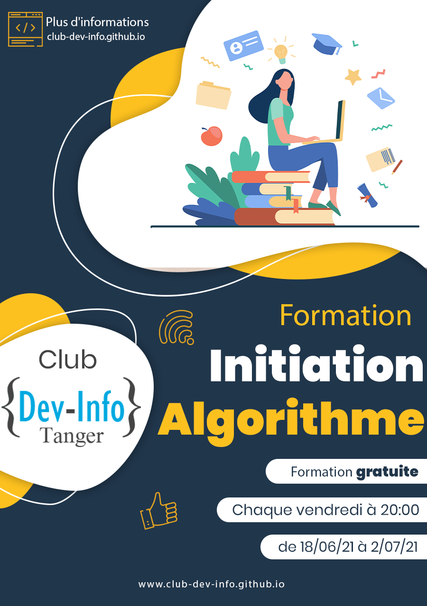

## Qu'est ce qu'un algorithme ?

Un programme est un code écrit par un programmeur pour être exécuter sur l'ordinateur afin de résoudre un problème de traitement d'information.

Pour apprendre à programmer, nous commençons d'abord à apprendre la logique de l'ordinateur et comment il pense ou comment nous devons penser pour écrire de code compréhensible par l'ordinateur. Cette logique s'appelle "Algorithme".

Dans notre formation **live**, en ligne et **gratuite** pour les membres du club. Nous allons vous expliquer et entraîner sur la logique de l’ordinateur étape par étape.

À la fin de cette formation vous serai capable d'écrire des programmes simples pour résoudre des problèmes de traitement d'information sur l'ordinateur. Aussi vous aurez une idée claire sur la programmation et sa logique, chose qui vous faciliterez la tâche d'apprentissage d'un langage de programmation.

## Programme de formation

1. Introduction
2. Comprendre l'ordinateur
3. Algorithme et pseudo-code
4. Variable et affectation
5. Entrée et sortie
6. Test et boucle

## Inscription à la formation

Pour s'inscrire à la formation, il suffit de remplir le formulaire suivant : 

[Formulaire d'inscription](https://docs.google.com/forms/d/e/1FAIpQLSfC7u09SGBZVyExH6Dtol5VYruSLTAjlHrDkdDDtzFpbPDSRg/viewform)

Nous allons vous envoyer un email content le lien de google meet au jour de la séance.

## Flayer

## Références 

- [Lien de la formation sur Udemy](https://www.udemy.com/course/les-bases-de-la-programmation-et-algorithme/?referralCode=0AB16423D1592F34D295/)
